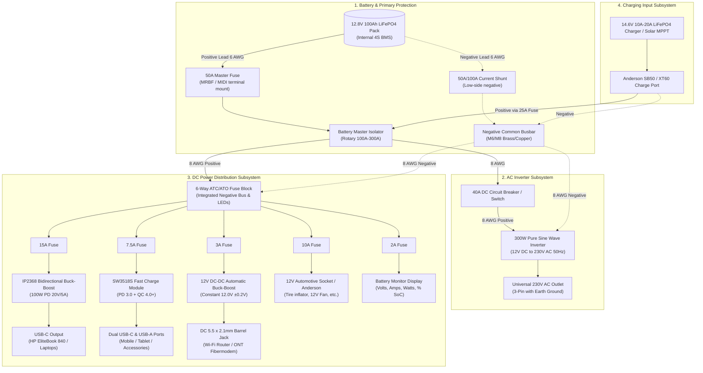

# 12.8V 100Ah LiFePO4 DIY Power Station

[](https://opensource.org/licenses/MIT)
[-blue.svg)](#battery-pack-specifications)
[-green.svg)](#dc-fast-charging-subsystem)
[](#ac-inverter-subsystem)

A high-efficiency, modular DC power station and emergency power supply (EPS) built around a **12.8V 100Ah (1280Wh) Lithium Iron Phosphate (LiFePO4)** battery pack. 

Designed for off-grid workspace powering, remote fieldwork, and home-office load-shedding backup. Capable of powering a workstation setup including an **HP EliteBook 840 via 65W/100W USB-C PD**, dual fast-charging for mobile devices, uninterrupted 12V Wi-Fi router operation, and an optional 230V AC pure sine wave inverter for auxiliary AC peripherals.

---

## Table of Contents
1. [Key Features & Highlights](#key-features--highlights)
2. [System Architecture & Schematic](#system-architecture--schematic)
3. [Subsystem Specifications](#subsystem-specifications)
4. [Bill of Materials (BOM) Summary](#bill-of-materials-bom-summary)
5. [Wire Sizing & Circuit Protection Matrix](#wire-sizing--circuit-protection-matrix)
6. [Runtime & Capacity Calculations](#runtime--capacity-calculations)
7. [Charging & Power Input](#charging--power-input)
8. [Commissioning & Safety Checklist](#commissioning--safety-checklist)
9. [Repository Structure](#repository-structure)
10. [License & Disclaimer](#license--disclaimer)

---

## Key Features & Highlights

- **Native DC-to-DC Efficiency**: High-efficiency buck-boost conversion directly from the 12V bus to 20V USB-C PD, eliminating double conversion losses (12V DC → 230V AC Inverter → AC Charger → 20V DC) which wastes 25–35% of stored battery energy.
- **True 100W Laptop Power Delivery**: Powered by the **IP2368 bidirectional buck-boost controller**, capable of delivering up to 20V @ 5A (100W) to charge heavy laptops, ultrabooks (HP EliteBook 840, ThinkPads, MacBook Pro), and USB-C power banks.
- **Multi-Protocol Smartphone Fast Charging**: Dual-port **SW3518S module** supporting USB-PD 3.0, PPS, QC 4.0+, Huawei FCP/SCP, and Samsung AFC.
- **Uninterrupted 12V Wi-Fi Router Line**: Regulated or filtered 12V DC barrel line ensuring home internet remains active during grid blackouts without AC inverter overhead.
- **Auxiliary 230V AC Pure Sine Wave Inverter**: Isolated 300W inverter branch with dedicated circuit protection for small AC appliances, soldering irons, or display monitors.
- **Comprehensive Protection**: Multi-tiered protection architecture featuring a 50A master fuse, marine-grade battery isolator, DC breaker for the inverter, and individual ATC/ATO blade fuses with blown-fuse LED indicators.
- **Precision Shunt Battery Monitoring**: High-accuracy Coulomb-counter shunt meter (volts, amps, real-time watts, state-of-charge %, and remaining run-time).

---

## System Architecture & Schematic

### ASCII Architecture

```text
====================================================================================================
                        12.8V 100Ah (1280Wh) LiFePO4 BATTERY PACK (WITH 4S BMS)
====================================================================================================
           │ (+) Positive Terminal                                  │ (-) Negative Terminal
           ▼                                                        ▼
   [ 50A Master Fuse ] (MIDI / MRBF / ANL)               [ 50A / 100A Shunt Sampler ]
           │                                                        │ (B- to P-)
           ▼                                                        ▼
 [ Heavy-Duty Isolator Switch ]                              [ Negative Common Busbar ]
           │                                                        │
           ├───────────────────────────────┐                        │
           │                               │                        │
           ▼                               ▼                        │
   [ 40A DC Breaker ]           [ 6-Way DC Fuse Block ]             │
           │                               │                        │
           ▼                               ├─ [15A Fuse] ───> [IP2368 100W Buck-Boost] ──> USB-C (Laptop)
   [ 300W Inverter ]                       │                                                (HP EliteBook 840)
    (12V DC -> 230V AC)                    ├─ [7.5A Fuse] ──> [SW3518S Fast Charge] ───────> USB-C + USB-A (Phones)
           │                               │
           ▼                               ├─ [ 3A Fuse] ───> [12V Regulated DC Port] ────> DC 5.5x2.1mm (Router)
    [ 230V AC Socket ]                     │
                                           ├─ [10A Fuse] ───> [12V Cigarette Socket / Aux] > 12V Car Appliances
                                           │
                                           ├─ [ 2A Fuse] ───> [Shunt Meter Power Line] ───> Voltmeter / SoC Display
                                           │
                                           └─ [Spare] ──────> [Expansion Port (Anderson)]
```

### Mermaid Electrical Flowchart



---

## Subsystem Specifications

### 1. Battery Pack Specifications
- **Chemistry**: Lithium Iron Phosphate ($LiFePO_4$ / LFP)
- **Cell Configuration**: 4S (4 cells in series: $4 \times 3.2V = 12.8V$ nominal)
- **Rated Capacity**: $100Ah$ @ 0.2C ($1280 Wh$)
- **Operating Voltage Range**:
  - Full Charge Cut-off: $14.6V$ ($3.65V / \text{cell}$)
  - Float / Rest (100%): $13.6V - 13.4V$ ($3.40V / \text{cell}$)
  - Nominal Working Plateau: $13.2V - 12.8V$ ($3.30V - 3.20V / \text{cell}$)
  - Recommended Discharge Cut-off (85–90% DoD): $11.5V$ ($2.875V / \text{cell}$)
  - BMS Hard Low-Voltage Cut-off: $10.0V$ ($2.50V / \text{cell}$)
- **Max Continuous Discharge**: $50A$ (limited by master fuse & wiring for this design, though battery BMS often supports 100A)
- **Internal Protection (BMS)**: Overcharge, over-discharge, overcurrent, short-circuit, high-temperature cutoff.

### 2. DC Fast Charging Subsystem

#### A. IP2368 100W Bidirectional Buck-Boost Module
- **Purpose**: Powers HP EliteBook 840 (demands 65W–100W USB-PD at 20V) directly from the 12V bus.
- **Why Buck-Boost is Required**: A 12.8V LiFePO4 battery swings between 14.6V (charging) and 11.0V (low). Delivering 20V Power Delivery (up to 5A) requires stepping up (boosting) the voltage. A standard buck-only charger cannot deliver 20V from a 12V input!
- **Input Voltage**: 10V – 28V DC
- **Output Capabilities**:
  - PD 3.0 / PPS: 5V@3A, 9V@3A, 12V@3A, 15V@3A, 20V@5A (Max 100W)
- **Efficiency**: ~94–96% at 20V/3.25A (65W)
- **Heatsinking**: Aluminum finned heatsink with thermal pad affixed over the inductor and MOSFETs.

#### B. SW3518S Dual-Port Fast Charge Module
- **Purpose**: High-speed smartphone and accessory charging (USB Type-C + Type-A).
- **Supported Protocols**: USB-PD 3.0, PPS, Qualcomm QC 2.0/3.0/4.0+, Huawei FCP/SCP (22.5W), Samsung AFC, Apple 2.4A.
- **Operating Current**: Typically 1A–3A at 12V input.
- **Protection**: Overvoltage, thermal limit, output short-circuit auto-recovery.

### 3. Dedicated 12V Wi-Fi Router Line
- **Why Regulation is Critical**: Typical residential Wi-Fi routers and Optical Network Terminals (ONT) expect $12.0V \pm 5\%$ ($11.4V - 12.6V$). A LiFePO4 battery at full charge reaches $14.4V - 14.6V$ during charging, which can trip overvoltage protection or overheat cheap router voltage regulators.
- **Design Choice**:
  - *Option A (Recommended)*: Automatic Buck-Boost DC-DC Converter (e.g., LM2596/XL6009 or LTC3780 mini module) set to a fixed **$12.0V \pm 0.1V$ output**, 3A continuous.
  - *Option B (Direct with LC Filter)*: Direct connection through a 3A fuse only if the router hardware specifies $9V - 15V$ wide-input tolerance.

### 4. 230V AC Pure Sine Wave Inverter Subsystem
- **Rated Continuous Power**: $300W$ (Surge capability: $600W$)
- **Waveform**: Pure Sine Wave ($<3\%$ THD), $230V \pm 5\%$, $50Hz \pm 0.5Hz$
- **No-Load / Idle Current**: $\le 0.45A$ ($\approx 5.5W$)
- **Protection**: DC input undervoltage alarm ($10.5V$), shutdown ($10.0V$), overvoltage ($15.5V$), thermal overload shutdown.
- **Dedicated Breaker**: 40A DC thermal-magnetic switch/breaker allowing easy isolation when running in DC-only mode to prevent idle standby drain.

---

## Bill of Materials (BOM) Summary

| Category | Component | Description & Key Specs | Qty | Target Model / Part No. | Est. Cost (USD / INR) |
|---|---|---|---|---|---|
| **Energy Storage** | LiFePO4 Battery Pack | 12.8V 100Ah (1280Wh), internal 4S 50A/100A BMS, M8 terminals | 1 | Eco-Worthy / Ampere Time / Redodo / Indian local LFP pack | $190 - $250 / ₹15,000 - ₹20,000 |
| **AC Inverter** | 300W Pure Sine Inverter | 12V DC to 230V AC 50Hz, 300W continuous / 600W surge | 1 | Bestek / Luminous / Su-Kam / Generic Pure Sine 300W | $40 - $55 / ₹3,000 - ₹4,500 |
| **DC Buck-Boost** | 100W USB-PD Module | IP2368 IC, bidirectional buck-boost, 20V 5A PD 3.0 PPS | 1 | IP2368 100W PD Module (with heatsink) | $15 - $22 / ₹1,200 - ₹1,800 |
| **DC Fast Charger** | Dual-Port USB Module | SW3518S chipset, Type-C (PD3.0) + Type-A (QC4.0/SCP), 65W | 1 | SW3518S Dual Fast-Charge PCB | $6 - $10 / ₹450 - ₹750 |
| **12V Regulator** | DC-DC Buck-Boost | Auto step-up/step-down 12V 3A-5A output, high efficiency | 1 | LTC3780 Mini / XL6009 / LM2577 auto buck-boost | $5 - $8 / ₹350 - ₹600 |
| **Protection** | Master Fuse Holder & Fuse | MIDI / MRBF terminal fuse block + 50A ceramic fuse | 1 | Blue Sea Systems / Littlefuse 50A MIDI | $6 - $12 / ₹450 - ₹900 |
| **Protection** | Inverter DC Breaker | 40A DC single-pole surface mount reset breaker / switch | 1 | 40A Resettable DC Marine Circuit Breaker | $6 - $10 / ₹450 - ₹750 |
| **Protection** | DC Distribution Block | 6-Way ATC/ATO blade fuse block with negative bus + blown-fuse LEDs | 1 | Blue Sea ST Blade 6-way / generic automotive fuse box | $12 - $18 / ₹900 - ₹1,400 |
| **Protection** | ATC/ATO Blade Fuses | Assorted pack: 2A, 3A, 5A, 7.5A, 10A, 15A, 20A | 1 set | Littelfuse / Bussmann fast-acting blade fuses | $4 - $6 / ₹250 - ₹450 |
| **Switching** | Main Isolator Switch | Heavy-duty rotary battery disconnect switch (100A–275A continuous) | 1 | Blue Sea m-Series / 100A battery cutoff switch | $10 - $16 / ₹750 - ₹1,200 |
| **Monitoring** | Battery Shunt Monitor | High-accuracy Coulomb-counting display with 50A/100A shunt | 1 | TF03K / Junctek / PZEM-015 DC Shunt Meter | $18 - $28 / ₹1,400 - ₹2,200 |
| **Wiring & Cabling**| 6 AWG (16mm²) Flexible Wire | Pure tinned copper silicone high-flex wire (Red & Black) | 2m | 6 AWG 200°C ultra-flexible silicone cable | $8 - $12 / ₹600 - ₹900 |
| **Wiring & Cabling**| 8 AWG (10mm²) Flexible Wire | Pure tinned copper silicone wire (for Inverter & Fuse Block) | 2m | 8 AWG silicone cable | $6 - $9 / ₹400 - ₹650 |
| **Wiring & Cabling**| 14 & 18 AWG Wire | Pure tinned copper wire for 100W PD and 12V low-power lines | 5m | 14 AWG & 18 AWG silicone stranded wire | $6 - $8 / ₹400 - ₹600 |
| **Connectors** | Copper Cable Lugs | M8 & M6 stud ring terminals (heavy-duty tinned copper) | 1 pk | SC16-8, SC16-6, SC10-6 crimp lugs | $6 - $9 / ₹400 - ₹650 |
| **Connectors** | DC Barrel Jack Cables | 5.5 x 2.1mm male-to-male high-current DC cables | 2 | 18 AWG 5.5x2.1mm DC barrel leads | $3 - $5 / ₹200 - ₹350 |
| **Connectors** | Charge Input Port | Anderson Powerpole PP45 / SB50 connector panel mount | 1 set | Anderson SB50 (Gray, 50A) with rubber boot | $5 - $8 / ₹350 - ₹600 |
| **Enclosure** | Power Station Case | Heavy-duty tool box or IP65 waterproof ammo can/Pelican style | 1 | Tactical ABS ammo can / DeWalt TSTAK / DIY plywood | $20 - $35 / ₹1,500 - ₹2,800 |
| **Hardware** | Fasteners & Standoffs | M3 nylon standoffs, M4 machine screws, heatshrink tubing | 1 set | Dual-wall adhesive heatshrink + hardware kit | $6 - $10 / ₹450 - ₹750 |
| **Charger** | AC-DC LiFePO4 Charger | 14.6V 10A-20A smart charger with CC/CV algorithm | 1 | 14.6V 10A dedicated LFP charger (Anderson plug) | $30 - $45 / ₹2,200 - ₹3,500 |

*A complete, line-itemized Bill of Materials with supplier links and alternate part cross-references is available in [BOM.md](BOM.md).*

---

## Wire Sizing & Circuit Protection Matrix

Every branch circuit is strictly coordinated to protect the conductor from overcurrent:

| Branch Circuit | Max Design Current | Fuse / Breaker Rating | Recommended Wire Gauge | Metric Equivalent | Max Allowed Voltage Drop |
|---|---|---|---|---|---|
| **Main Battery to Busbar** | 50A | 50A MIDI / MRBF Fuse | 6 AWG | 16 $mm^2$ | $< 0.8\%$ ($< 0.10V$) |
| **Inverter Supply Branch** | 30A (continuous) / 38A (peak) | 40A DC Breaker | 8 AWG | 10 $mm^2$ | $< 1.2\%$ ($< 0.15V$) |
| **Fuse Block Feed Line** | 30A (sum of DC loads) | Shared 50A Master | 8 AWG | 10 $mm^2$ | $< 1.0\%$ ($< 0.13V$) |
| **IP2368 100W PD Output** | 9.2A (@ 11.5V input, 94% eff) | 15A Blade Fuse | 14 AWG | 2.5 $mm^2$ | $< 1.5\%$ ($< 0.18V$) |
| **SW3518S Dual Fast-Charge** | 5.5A (@ 12V input, 65W output) | 7.5A Blade Fuse | 16 AWG | 1.5 $mm^2$ | $< 1.5\%$ ($< 0.18V$) |
| **12V Wi-Fi Router Line** | 2.0A (@ 12V) | 3A Blade Fuse | 18 AWG | 0.75 $mm^2$ | $< 1.0\%$ ($< 0.12V$) |
| **Shunt Sense Line** | 50mA | 1A or 2A In-line Fuse | 22 AWG | 0.34 $mm^2$ | Negligible |
| **External Charge Input** | 20A (max charge rate) | 25A Blade / MIDI Fuse | 10 AWG | 6 $mm^2$ | $< 1.0\%$ ($< 0.13V$) |

> [!IMPORTANT]
> **Fuse Placement Rule**: The 50A Master Fuse must be placed within **7 inches (18 cm)** of the battery positive terminal before any switches or distribution blocks. This prevents unfused battery cables from shorting to ground.

---

## Runtime & Capacity Calculations

### Total Usable Energy

$$\text{Nominal Energy} = 12.8\text{ V} \times 100\text{ Ah} = 1280\text{ Wh}$$

Assuming a conservative **85% Depth-of-Discharge (DoD)** to maximize battery lifespan ($>3500\text{ cycles}$):

$$\text{Usable Capacity} = 1280\text{ Wh} \times 0.85 = 1088\text{ Wh}$$

### Load Scenarios & Estimated Operating Times

| Device / Load | Power Draw | Operational Mode | Net Efficiency | Effective Hourly Drain | Estimated Continuous Runtime |
|---|---|---|---|---|---|
| **HP EliteBook 840 (Office Work)** | 25W - 35W average | DC-to-DC (IP2368 PD 20V) | ~94% | ~32 Wh/hr | **34.0 Hours** (~4 full workdays) |
| **HP EliteBook 840 (Full Benchmark/Load)**| 65W continuous | DC-to-DC (IP2368 PD 20V) | ~93% | ~70 Wh/hr | **15.5 Hours** |
| **Wi-Fi Router + Fiber ONT** | 12W (12V @ 1.0A) | DC-to-DC Regulated 12V | ~92% | ~13 Wh/hr | **83.6 Hours** (~3.5 days 24/7) |
| **Smartphone (5000 mAh battery)** | 18.5 Wh per charge | SW3518S Fast Charge | ~92% | ~20 Wh per full cycle | **54 Full Recharges** |
| **Entire Workstation (Simultaneous)**<br>• Laptop (35W)<br>• Wi-Fi Router (12W)<br>• Phone charging (15W)<br>• Shunt/parasitic (1W) | **63W total** | All DC-to-DC Native | ~93% blended | ~67.7 Wh/hr | **16.0 Hours** of uninterrupted work |
| **AC Inverter Mode (Laptop via AC Brick)** | 35W laptop + 5.5W inverter idle | Inverter 230V AC + AC Adapter | ~78% blended | ~52 Wh/hr | **20.9 Hours** *(vs 34 hrs on native DC!)* |

> [!TIP]
> **DC Efficiency Advantage**: Running the HP EliteBook 840 directly from the IP2368 USB-C PD module yields **62% longer battery runtime** compared to powering the laptop's original AC wall adapter through the 230V inverter! Always use native DC ports when possible.

---

## Charging & Power Input

The power station supports two primary replenishment methods via a dedicated **Anderson SB50 / XT60 port**:

1. **Mains AC-DC LiFePO4 Smart Charger**:
   - Algorithm: 2-stage constant current / constant voltage (CC/CV).
   - Cut-off Voltage: $14.6V \pm 0.1V$.
   - Recommended Current: $10A - 20A$ (0.1C to 0.2C rate).
   - Charge Time: $\approx 5\text{ to }6\text{ hours}$ from 0 to 100% with a 20A charger.
2. **Solar MPPT Input (Optional Expansion)**:
   - Connect a 150W–250W rigid/foldable solar panel via an external or internal 20A MPPT charge controller (e.g., Victron SmartSolar 75/15 or EPEver Tracer 1210AN).
   - Typical daily solar harvest (4–5 peak sun hours): $600Wh - 900Wh$ (sufficient to replenish daily workstation usage indefinitely).

---

## Commissioning & Safety Checklist

Follow this sequence before connecting expensive end devices:

- [ ] **Step 1: Visual Inspection**: Verify all cable lugs are crimped tightly with heatshrink collars. Check that no wire strands are straying outside terminals.
- [ ] **Step 2: Polarity Verification**: Using a digital multimeter (DMM) in DC Voltage mode, verify (+) and (-) polarity from the battery terminals through the master fuse and to the isolator switch.
- [ ] **Step 3: Shunt Low-Side Wiring**: Ensure the battery negative cable goes **only** to the shunt's `B-` terminal. No other ground or negative return wires should bypass the shunt.
- [ ] **Step 4: Smoke Test (Fuses Removed)**:
  - Turn off all breakers and pull all branch fuses from the fuse block.
  - Turn ON the main isolator switch.
  - Measure voltage across the fuse block positive and negative busbars (should read $13.0V - 13.4V$).
- [ ] **Step 5: Branch-by-Branch Testing**:
  - Insert the 3A fuse for the router line. Measure output on the 5.5x2.1mm DC barrel connector with DMM. Verify **center-positive** ($+12.0V$) and outer-negative.
  - Insert the 7.5A fuse for the SW3518S module. Verify power LED illuminates and test with a cheap USB tester or dummy load.
  - Insert the 15A fuse for the IP2368 module. Connect a USB-C power meter. Verify negotiation through 5V, 9V, 15V, and 20V PDO profiles using a PD trigger tester or test device.
  - Close the 40A inverter breaker and turn on the inverter switch. Verify inverter status LED turns green. Measure AC outlet with DMM in AC Voltage mode ($230V \pm 10V$, $50Hz$).
- [ ] **Step 6: Battery Monitor Calibration**:
  - Fully charge the battery pack with the 14.6V charger until current drops below $1.5A$.
  - Long-press the 100% button on the TF03K / PZEM shunt meter to set full-capacity calibration ($100Ah$).

---

## Repository Structure

```text
├── README.md                          # Master documentation & system overview
├── BOM.md                             # Comprehensive, line-itemized Bill of Materials
├── docs/
│   ├── WIRING_AND_SCHEMATICS.md       # Detailed pinout, crimping guide & wiring table
│   ├── SAFETY_AND_COMMISSIONING.md    # Multi-stage testing, safety protocols & maintenance
│   └── RUNTIME_CALCULATIONS.md        # Extended power budgets, efficiency & math formulas
└── .gitignore                         # Standard git ignore rules
```

---

## License & Disclaimer

This project documentation and design is open-source under the [MIT License](LICENSE).

**Disclaimer**: Building high-capacity lithium battery systems involves risks of electrical shock, short-circuit fire, and equipment damage. Always exercise standard electrical safety precautions, wear eye protection, use insulated tools, and verify all connections with a digital multimeter before powering on. Neither the author nor contributors are liable for any damages or injuries resulting from the use of these designs.
